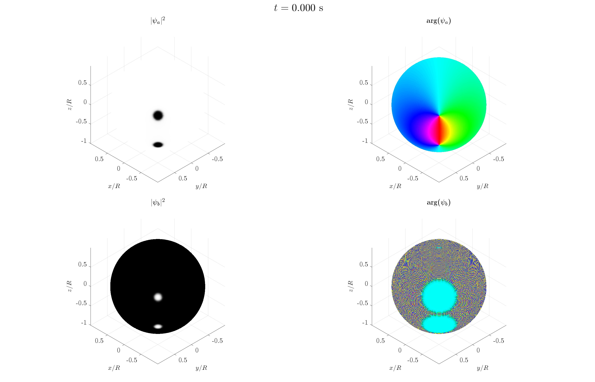

# Massive vortex dipole on a spherical superfluid shell

[](https://doi.org/10.5281/zenodo.21351319)

MATLAB code for the preparation, real-time Gross–Pitaevskii evolution, and post-processing of a massive vortex dipole on a spherical superfluid shell.

The code was developed for the numerical simulations of massive-vortex dynamics reported in:

> M. Sorba and A. Richaud,  
> *A magnetic monopole in a superfluid bubble*,  
> arXiv:2607.15093 (2026).  
> [https://doi.org/10.48550/arXiv.2607.15093](https://doi.org/10.48550/arXiv.2607.15093)

The simulations describe a two-component Bose–Einstein condensate confined to a spherical shell. Vortices are hosted by component *a*, while component *b* fills the vortex cores and provides an effective inertial mass to the vortex excitations. The dynamics are obtained by solving the coupled Gross–Pitaevskii equations on the sphere.

The released workflows study:

- the dependence of the vortex dynamics on the atom number <i>N</i><sub>b</sub> of the core-filling component;
- the dependence on the initial vortex position;
- the effect of a residual gravitational acceleration.

<p align="center">
  
</p>

<p align="center">
  <em>Representative Gross–Pitaevskii evolution of a massive vortex dipole on a spherical superfluid shell. The density and phase of the vortex-hosting component <i>a</i> and of the core-filling component <i>b</i> are shown during the real-time dynamics.</em>
</p>

## Repository structure

```text
massive-vortex-dipole-on-sphere/
├── run/
│   ├── run_sweep_core_filling_atom_number.m
│   ├── run_sweep_initial_position.m
│   └── run_sweep_residual_gravity.m
│
├── src/
│   ├── ground_state/
│   ├── dynamics/
│   ├── diagnostics/
│   └── utilities/
│
├── postprocessing/
│   ├── analyze_atom_number_sweep.m
│   ├── analyze_initial_position_sweep.m
│   ├── create_atom_number_sweep_videos.m
│   └── create_initial_position_sweep_videos.m
│
└── output/
```

The `run/` directory contains the three main simulation entry points. Numerical routines for state preparation, real-time evolution, diagnostics, and spherical-grid operations are collected in `src/`. Analysis and video-generation scripts are provided in `postprocessing/`.

Simulation data, diagnostic figures, and frames are written below `output/`. Generated output is not tracked by Git.

## Requirements

The code requires:

- MATLAB;
- MATLAB Parallel Computing Toolbox for the sweep scripts, which use `parfor`;
- the SSHT (Spin Spherical Harmonic Transform) library.

## SSHT dependency

This code explicitly relies on **SSHT: Fast spin spherical harmonic transforms**, developed by Jason McEwen and collaborators.

SSHT is an external dependency and is **not distributed with this repository**. The MATLAB version of SSHT must be installed separately and made available on the MATLAB path before running the simulations.

- [SSHT source repository](https://github.com/astro-informatics/ssht)
- [SSHT documentation](https://astro-informatics.github.io/ssht/)
- [SSHT project page](http://www.jasonmcewen.org/project/ssht/)

The present code calls the following SSHT routines:

```text
ssht_sampling
ssht_forward
ssht_inverse
ssht_plot_sphere
```

The simulation entry points automatically check that these functions are available on the MATLAB path.

The SSHT developers request that work resulting in publication reference the SSHT repository and cite the related academic papers:

J. D. McEwen and Y. Wiaux,  
*A novel sampling theorem on the sphere*,  
IEEE Transactions on Signal Processing **59**, 5876–5887 (2011).

J. D. McEwen, G. Puy, J.-Ph. Thiran, P. Vandergheynst, D. Van De Ville, and Y. Wiaux,  
*Sparse image reconstruction on the sphere: implications of a new sampling theorem*,  
IEEE Transactions on Image Processing **22**, 2275–2285 (2013).

SSHT is released separately under the GPL-3.0 license. Please consult the SSHT repository and documentation for installation and licensing details.

## Running the simulations

The three main simulation workflows are located in `run/`.

Each entry-point script determines the repository root from its own file location and adds the `src/` tree to the MATLAB path automatically. SSHT itself must already be available on the MATLAB path.

### 1. Core-filling atom-number sweep

Run:

```matlab
run_sweep_core_filling_atom_number
```

For each value of <i>N</i><sub>b</sub>, the script:

1. computes a pinned two-component state by imaginary-time evolution;
2. performs the unpinned real-time evolution of the massive vortex dipole;
3. stores the resulting trajectories, diagnostics, figures, and simulation frames.

The default sweep is:

```matlab
N_b_values = 1000:1000:10000;
```

Results are written to:

```text
output/Sweep_Nb/N_b_<value>/
```

### 2. Initial-position sweep

Run:

```matlab
run_sweep_initial_position
```

This workflow studies the dynamics at fixed core-filling atom number for different initial polar positions of the vortex dipole.

The default calculation uses:

```matlab
N_b = 3000;
theta_1_values = linspace(0.1, pi/2 - 0.1, 10);
```

Results are written to:

```text
output/Sweep_theta_initial/theta1_<value>/
```

The current analysis script `analyze_initial_position_sweep.m` processes the first nine values of the default sweep, consistently with the dataset used in the original analysis. The video-generation script scans all ten default cases and skips cases for which no frame directory or JPEG frames are found.

### 3. Residual-gravity sweep

Run:

```matlab
run_sweep_residual_gravity
```

This workflow studies the effect of a weak residual gravitational acceleration.

The default residual accelerations are:

```matlab
g_residual_fractions = [1e-7, 1e-6, 1e-5, 1e-4];
```

where each value is a fraction of terrestrial gravitational acceleration.

The residual-gravity workflow starts from the converged <i>N</i><sub>b</sub> = 6000 state generated by the core-filling atom-number sweep. Therefore, the corresponding ground-state file must exist at:

```text
output/Sweep_Nb/N_b_6000/Vortexon_dipole_on_sphere.mat
```

In the default workflow, this file is generated by:

```matlab
run_sweep_core_filling_atom_number
```

Results are written to:

```text
output/Sweep_g_residual/g_residual_<value>/
```

## Post-processing

The `postprocessing/` directory contains scripts for analysing saved simulation output and generating MPEG-4 videos from JPEG frames.

For the core-filling atom-number sweep:

```matlab
analyze_atom_number_sweep
create_atom_number_sweep_videos
```

For the initial-position sweep:

```matlab
analyze_initial_position_sweep
create_initial_position_sweep_videos
```

The post-processing scripts expect the standard directory structure generated by the corresponding simulation entry points.

No dedicated residual-gravity post-processing script is included in this release.

## Numerical implementation

The coupled Gross–Pitaevskii equations are evolved directly on a spherical grid.

The spherical sampling and spherical-harmonic transforms are handled using SSHT. The numerical routines use the spherical-harmonic representation to evaluate the spherical Laplacian and to apply spectral filtering.

Pinned initial states are prepared by imaginary-time evolution. The subsequent massive-vortex dynamics are obtained by real-time evolution after removal of the pinning potential.

The repository also includes diagnostic routines for quantities used in the analysis, including:

- positions of the peaks of the core-filling component;
- total energy;
- compressible and incompressible kinetic-energy contributions;
- total angular momentum along the *z* axis;
- excluded mass associated with the vortex-core density depletion.

## Output and data storage

Simulation output is written below the `output/` directory.

The real-time simulations can generate large MATLAB data files and many JPEG frames. These generated files are intentionally excluded from version control through `.gitignore`.

Video-generation scripts read the JPEG frames stored in the `Temp_real` directories and create MPEG-4 files. Simulation data are not modified by these scripts.

## Related repository

The single-component Gross–Pitaevskii simulations of equatorial vortex-necklace formation and Kelvin–Helmholtz-like instability reported in the same work are available in the companion repository:

- [Superfluid Kelvin–Helmholtz instability on a spherical shell](https://github.com/AndreaRichaud/superfluid-kelvin-helmholtz-instability-on-sphere)

## Citation

If you use this software in published work, please cite the associated research article:

> M. Sorba and A. Richaud,  
> *A magnetic monopole in a superfluid bubble*,  
> arXiv:2607.15093 (2026).  
> [https://doi.org/10.48550/arXiv.2607.15093](https://doi.org/10.48550/arXiv.2607.15093)

Please also cite the archived software release when referring specifically to the numerical implementation or to a particular version of the code:

> A. Richaud and M. Sorba,  
> *Massive vortex dipole on a spherical superfluid shell*,  
> version 1.0.0, Zenodo (2026).  
> [https://doi.org/10.5281/zenodo.21351319](https://doi.org/10.5281/zenodo.21351319)

Since this software uses SSHT for spherical-harmonic transforms, users should also follow the referencing instructions provided by the SSHT developers and cite the relevant SSHT papers listed above.

## License

The original code in this repository is distributed under the GNU General Public License v3.0. See the `LICENSE` file for details.

SSHT is an external software dependency and is not included in this repository. SSHT is distributed separately under the GPL-3.0 license.

## Contact

For questions concerning the simulations or numerical implementation, please contact:

**Andrea Richaud**  
Universitat Politècnica de Catalunya (UPC)